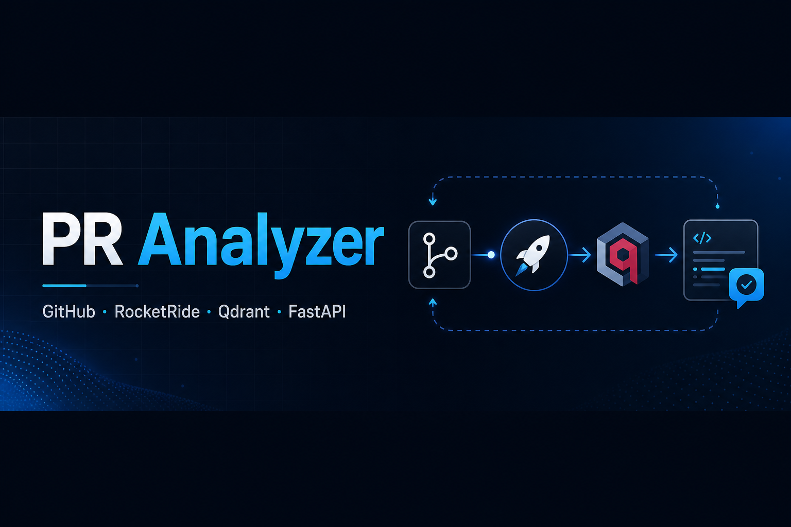
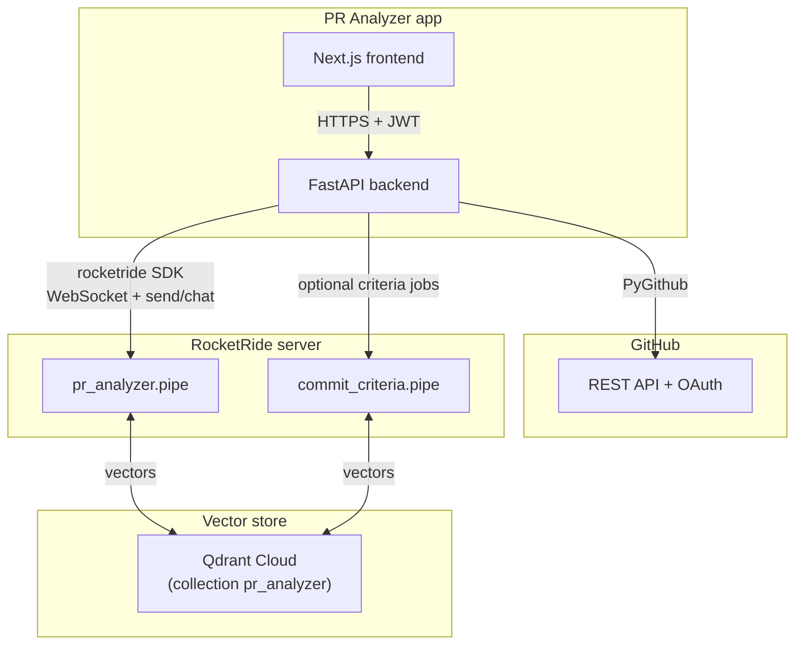
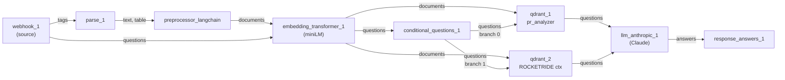
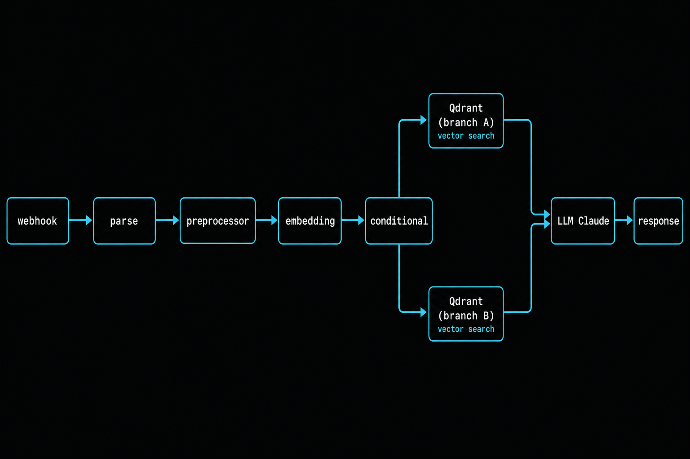

# PR Analyzer

AI-powered **GitHub Pull Request** intelligence: topic clustering, duplicate hints, quality scoring (0–100), merge-style recommendations, and natural-language chat over your repo—all driven by **RocketRide** pipelines and a **FastAPI** backend.

<p align="center">
  <a href="https://www.instagram.com/dsapandora/" title="Instagram"></a>
  &nbsp;
  <a href="https://x.com/dsapandora" title="X @dsapandora"></a>
  &nbsp;
  <a href="https://github.com/dsapandora" title="GitHub @dsapandora"></a>
</p>

<p align="center">
  <a href="https://github.com/dsapandora/pr_analyzer" title="PR Analyzer repository">
    
  </a>
</p>

**Author:** Ariel Vernaza ([@dsapandora](https://github.com/dsapandora)) — [ariel@lazyracoon.tech](mailto:ariel@lazyracoon.tech)

## What it does

1. **GitHub** — OAuth login; lists repos and open PRs via the GitHub API (PyGithub).
2. **Ingestion** — Each PR is turned into a text bundle (title, description, file list, truncated diff) and sent to the **RocketRide** server through the official **Python SDK** (`rocketride`).
3. **RocketRide pipeline** — [`pipeline/pr_analyzer.pipe`](pipeline/pr_analyzer.pipe) chunks text, embeds it, writes vectors to **Qdrant**, and runs **Claude** with RAG context (including a second Qdrant branch for cross-repo context when configured).
4. **Backend orchestration** — FastAPI calls `send_pr(...)` (plain text over the pipeline **webhook** token) then `chat(...)` with `application/rocketride-question` so the same graph answers with retrieved passages.
5. **Frontend** — Next.js dashboard: topics, scores, recommendations, and chat.

## GitHub integration

- **OAuth 2** — Users authorize the app; the backend exchanges the code for a token and issues a **JWT** for API calls.
- **Repository data** — The backend fetches open PRs, metadata, and diffs from GitHub and persists analysis results in your app database (see `.env.example` for `DATABASE_URL` / Heroku JawsDB).
- **No GitHub App required for the MVP path** — integration is OAuth + REST as implemented in the FastAPI routes.

## RocketRide integration & how PRs are analyzed on the backend

On startup, `RocketRideClient` connects to **`ROCKETRIDE_URI`** (WebSocket-capable URI; `ROCKETRIDE_URL` is accepted as an alias), maps app secrets into pipeline env vars (`ROCKETRIDE_ANTHROPIC_APIKEY`, `ROCKETRIDE_OPENAI_KEY`, `ROCKETRIDE_QDRANT_*`, …), and calls `use(filepath="pipeline/<name>.pipe", source="webhook_1")` to obtain a **long-lived webhook token** for the main analysis pipeline (and optionally a second token for [`pipeline/commit_criteria.pipe`](pipeline/commit_criteria.pipe)), matching the Python client pattern in **ROCKETRIDE_QUICKSTART.md** (`connect` → `use` → `send`).

For each PR, `RocketrideService.analyze_pr`:

1. Builds `pr_text` (title, description, files, diff caps).
2. **`send_pr`** — `client.send(token, pr_text, mimetype="text/plain", objinfo=…)` so the pipeline **parses → splits → embeds → upserts** into the `pr_analyzer` Qdrant collection.
3. **`chat`** — Builds a `Question` JSON (`application/rocketride-question`) with the analysis prompt so **Qdrant retrieval + Claude** return a JSON payload (topics, score, recommendation, `similar_prs`, …) parsed by the backend.

User chat on a PR reuses the **same** webhook token and MIME type so retrieval stays aligned with stored embeddings.

## System integration (components)



## `pr_analyzer.pipe` topology (data + control flow)



## Behavioural math (RAG + similarity)

- **Embeddings** — Chunk text is mapped to $ \mathbf{e} \in \mathbb{R}^d $ (miniLM profile in the pipe). Stored vectors index each PR chunk in Qdrant.
- **Retrieval score** — For query embedding $ \mathbf{q} $ and stored chunk $ \mathbf{c} $, Qdrant uses the **cosine metric** (equivalent to maximizing $ \mathbf{q}^{\top}\mathbf{c} $ when vectors are L2-normalized):

$$
s(\mathbf{q}, \mathbf{c}) = \frac{\mathbf{q}^{\top}\mathbf{c}}{\|\mathbf{q}\|_2\,\|\mathbf{c}\|_2}.
$$

- **Duplicate / “similar PR” hints** — The LLM prompt asks for `similar_prs` using **retrieved neighbours** in vector space: high $ s $ means overlapping scope (subject to the pipeline’s top‑$K$ hits and the second Qdrant node’s **score threshold** in `pr_analyzer.pipe` for the `ROCKETRIDE` collection branch).
- **Quality score** — The model emits a bounded scalar **score** $\in [0,100]$ and a discrete **recommendation** in $\{\texttt{merge}, \texttt{keep}, \texttt{discard}, \texttt{combine}\}$; these are **LLM outputs**, not a closed-form objective—treat them as calibrated heuristics.

## Pipeline visual (reference diagram)



Source of truth for node IDs and wiring: [`pipeline/pr_analyzer.pipe`](pipeline/pr_analyzer.pipe). A separate graph [`pipeline/commit_criteria.pipe`](pipeline/commit_criteria.pipe) powers optional **commit / engineering-pattern** ingestion (`commit_criteria` collection).

## Architecture (text)

```
Browser (Next.js) ──HTTPS/JWT──► FastAPI (Heroku or local)
                                    │
                    ┌───────────────┼───────────────┐
                    ▼               ▼               ▼
              GitHub API      RocketRide SDK      Qdrant Cloud
              (OAuth/REST)    (pipelines)         (vectors)
```

## Tech Stack

| Layer      | Technology                                |
|------------|-------------------------------------------|
| Frontend   | Next.js 14 (App Router), TypeScript, Tailwind CSS |
| Backend    | FastAPI (Python 3.11+), Pydantic v2       |
| Auth       | GitHub OAuth → JWT                        |
| Pipeline   | RocketRide server (e.g. Fly.io)           |
| Vector DB  | Qdrant Cloud                              |
| LLM        | Anthropic Claude (via RocketRide `llm_anthropic`) |
| Embeddings | OpenAI + in-pipeline embedding nodes      |
| Hosting    | Heroku / Vercel (app) + Fly.io (RocketRide) |

## Local Development

### Prerequisites

- Node.js 20+
- Python 3.11+
- A GitHub OAuth App
- Qdrant Cloud account (or run Qdrant locally with Docker)
- RocketRide server running (or use direct API fallback)

### 1. Clone and Configure

```bash
git clone https://github.com/dsapandora/pr_analyzer.git
cd pr_analyzer
cp .env.example .env
# Edit .env with your credentials
```

### 2. Backend Setup

```bash
cd backend
python -m venv venv
source venv/bin/activate  # Windows: venv\Scripts\activate
pip install -r requirements.txt

# Run development server
uvicorn app.main:app --reload --port 8000
```

### 3. Frontend Setup

```bash
cd frontend
npm install

# Run development server
npm run dev
```

App is available at http://localhost:3000

### 4. Docker Compose (All-in-One)

```bash
# Start backend + frontend
docker-compose up

# Start with local Qdrant (no cloud needed)
docker-compose --profile local-qdrant up
```

## Environment Variables

### Backend (`.env`)

| Variable | Required | Description |
|----------|----------|-------------|
| `GITHUB_CLIENT_ID` | Yes | GitHub OAuth App client ID |
| `GITHUB_CLIENT_SECRET` | Yes | GitHub OAuth App client secret |
| `JWT_SECRET_KEY` | Yes | Random secret for JWT signing (32+ chars) |
| `ROCKETRIDE_URI` | Yes | RocketRide server base URI (Quickstart name); `wss://` / `https://` accepted |
| `ROCKETRIDE_URL` | No | Legacy alias for `ROCKETRIDE_URI` |
| `ROCKETRIDE_APIKEY` | No | API key if your server requires auth (`ROCKETRIDE_API_KEY` alias) |
| `ROCKETRIDE_PIPELINE` | No | Pipeline file stem for PR analysis (default `pr_analyzer` → `pipeline/pr_analyzer.pipe`) |
| `QDRANT_URL` | Yes | Qdrant Cloud cluster URL |
| `QDRANT_API_KEY` | No | Qdrant API key (required for cloud) |
| `ANTHROPIC_API_KEY` | Yes | Anthropic API key (fallback if RocketRide down) |
| `OPENAI_API_KEY` | Yes | OpenAI API key for embeddings |

### Frontend (`.env.local`)

| Variable | Required | Description |
|----------|----------|-------------|
| `NEXTAUTH_URL` | Yes | Full URL of your Next.js app |
| `NEXTAUTH_SECRET` | Yes | Random secret for NextAuth |
| `NEXT_PUBLIC_API_URL` | Yes | URL of your FastAPI backend |
| `GITHUB_CLIENT_ID` | Yes | Same GitHub OAuth App client ID |
| `GITHUB_CLIENT_SECRET` | Yes | Same GitHub OAuth App client secret |

## GitHub OAuth App Setup

1. Go to https://github.com/settings/developers
2. Click "New OAuth App"
3. Fill in:
   - **Application name**: PR Analyzer
   - **Homepage URL**: `http://localhost:3000` (or your production URL)
   - **Authorization callback URL**: `http://localhost:8000/auth/github/callback`
4. Copy the **Client ID** and **Client Secret** to `.env`

## Deployment

### Backend → Heroku

```bash
# Install Heroku CLI
heroku create your-pr-analyzer-api

# Set environment variables
heroku config:set GITHUB_CLIENT_ID=...
heroku config:set GITHUB_CLIENT_SECRET=...
heroku config:set JWT_SECRET_KEY=$(openssl rand -hex 32)
heroku config:set ROCKETRIDE_URI=wss://your-rocketride.fly.dev
heroku config:set QDRANT_URL=https://your-cluster.qdrant.io
heroku config:set QDRANT_API_KEY=...
heroku config:set ANTHROPIC_API_KEY=...
heroku config:set OPENAI_API_KEY=...

# Deploy
cd backend
git init
heroku git:remote -a your-pr-analyzer-api
git add .
git commit -m "Deploy PR Analyzer backend"
git push heroku main
```

### Frontend → Heroku (or Vercel)

**Vercel (recommended):**
```bash
cd frontend
npx vercel
# Set environment variables in Vercel dashboard
```

**Heroku:**
```bash
heroku create your-pr-analyzer-app
heroku buildpacks:set heroku/nodejs

heroku config:set NEXTAUTH_URL=https://your-pr-analyzer-app.herokuapp.com
heroku config:set NEXTAUTH_SECRET=$(openssl rand -hex 32)
heroku config:set NEXT_PUBLIC_API_URL=https://your-pr-analyzer-api.herokuapp.com
heroku config:set GITHUB_CLIENT_ID=...
heroku config:set GITHUB_CLIENT_SECRET=...

cd frontend
git push heroku main
```

### RocketRide → Fly.io

```bash
# Install flyctl
curl -L https://fly.io/install.sh | sh

# Deploy RocketRide server
cd /path/to/rocketride-server
fly launch
fly secrets set ANTHROPIC_API_KEY=...
fly secrets set OPENAI_API_KEY=...

# Upload pipeline configs from this repo:
#   pipeline/pr_analyzer.pipe
#   pipeline/commit_criteria.pipe
# Chat in this app reuses the main `pr_analyzer` webhook token (no separate `pr_chat.pipe` in-repo).
```

### Qdrant Cloud

1. Go to https://cloud.qdrant.io
2. Create a free cluster
3. Copy the **Cluster URL** and **API Key** to your `.env`
4. The collection `pr_analyzer` is created automatically on first analysis

## API Reference

### Authentication
All endpoints (except `/health` and `/auth/*`) require a JWT Bearer token.

```
Authorization: Bearer <jwt_token>
```

### Endpoints

| Method | Path | Description |
|--------|------|-------------|
| `GET` | `/health` | Health check |
| `GET` | `/auth/github/login` | Redirect to GitHub OAuth |
| `GET` | `/auth/github/callback` | OAuth callback → redirect with JWT |
| `GET` | `/repos` | List user's GitHub repositories |
| `GET` | `/prs?repo=owner/repo` | List analyzed PRs |
| `GET` | `/prs/{number}?repo=owner/repo` | Single PR details |
| `GET` | `/prs/topics?repo=owner/repo` | List unique topics |
| `GET` | `/prs/stats?repo=owner/repo` | Aggregate statistics |
| `POST` | `/analyze` | Trigger analysis pipeline |
| `GET` | `/analyze/status/{job_id}` | Check analysis progress |
| `POST` | `/chat` | Chat about a specific PR |

### POST /analyze
```json
{
  "repo": "owner/repository-name"
}
```

### POST /chat
```json
{
  "pr_number": 42,
  "repo": "owner/repository-name",
  "message": "Is this PR safe to merge?",
  "history": [
    {"role": "user", "content": "What does this PR do?"},
    {"role": "assistant", "content": "This PR adds..."}
  ]
}
```

## Pipeline files in this repo

| File | Role |
|------|------|
| [`pipeline/pr_analyzer.pipe`](pipeline/pr_analyzer.pipe) | Main PR ingest + RAG + Claude + answers |
| [`pipeline/commit_criteria.pipe`](pipeline/commit_criteria.pipe) | Commit / pattern corpus for criteria features |

Upload them to your RocketRide server’s pipeline directory (or equivalent deployment path).

## Features

- **Topic Clustering**: Automatically groups PRs by domain (vectordb, engine, llms, integrations, ui, bugfix, docs, testing, devops)
- **Quality Scoring**: 0-100 score based on code quality, clarity, test coverage, and purpose
- **Duplicate Detection**: Vector similarity search finds PRs that overlap in scope
- **Recommendations**: Merge / Keep / Discard / Combine based on AI analysis
- **AI Chat**: Ask any question about a PR in natural language
- **Dark UI**: Professional dark theme with smooth animations
- **Responsive**: Works on desktop and mobile

## Contributing

1. Fork the repository
2. Create a feature branch: `git checkout -b feature/my-feature`
3. Commit changes: `git commit -m 'Add my feature'`
4. Push: `git push origin feature/my-feature`
5. Open a Pull Request

## License

MIT
